# Hướng Dẫn Phân Tích Thiết Kế Hệ Thống Cho Đề Tài Report Approval

Tài liệu này được viết dựa trực tiếp trên logic hiện có của code trong repo `ReportApproval`.
Mục tiêu là giúp bạn làm phần phân tích thiết kế hệ thống theo bố cục gần với mẫu `.docx` đã gửi, nhưng nội dung phải đúng với bài của mình.

Bạn có thể dùng tài liệu này theo 2 cách:

1. Dùng nguyên văn các phần mô tả, bảng và ghi chú logic để đưa vào báo cáo.
2. Dùng các đoạn mã Mermaid/PlantUML trong file này để vẽ lại sơ đồ bằng `draw.io`, `PlantUML`, `Mermaid Live Editor`, `StarUML` hoặc Word.

## Các lưu ý logic bắt buộc phải giữ đúng theo code

- Hệ thống có 4 vai trò: `Staff`, `Manager`, `Director`, `Admin`.
- `Staff` tạo báo cáo thì báo cáo đi vào trạng thái `PendingManager`.
- `Manager` tạo báo cáo thì bỏ qua cấp trưởng phòng và đi thẳng vào `PendingDirector`.
- `Director` tạo báo cáo thì được duyệt ngay, trạng thái là `Approved`.
- `Manager` trả báo cáo thì báo cáo về cho nhân viên, trạng thái `Returned`.
- `Director` trả báo cáo thì báo cáo quay lại cho trưởng phòng xử lý tiếp, trạng thái quay về `PendingManager`.
- `Admin` không tạo báo cáo qua chức năng nộp báo cáo.
- Nhiệm vụ chỉ được giao cho `Staff`, nhưng người giao có thể là `Manager`, `Director` hoặc `Admin`.
- `Staff` là người duy nhất được cập nhật trạng thái nhiệm vụ của chính nhiệm vụ được giao.
- CSDL hiện tại không tách riêng bảng chi tiết cho mẫu `chấm công` hay `doanh thu điện`; dữ liệu mẫu đang được serialize vào `Content` và sinh file đính kèm Excel.

## 2.1. Mô tả bài toán và nguồn gốc đề tài

### Nội dung đề xuất để viết vào báo cáo

Đề tài xây dựng hệ thống quản lý báo cáo nội bộ có tích hợp quy trình phê duyệt nhiều cấp, giao việc và quản trị người dùng. Trong thực tế, việc lập báo cáo tại đơn vị thường được thực hiện thủ công qua file Word, Excel, email hoặc các công cụ nhắn tin nội bộ, dẫn đến khó kiểm soát phiên bản, khó theo dõi trạng thái xử lý và khó lưu vết trách nhiệm của từng cá nhân trong quá trình phê duyệt.

Từ nhu cầu đó, hệ thống `Report Approval` được xây dựng nhằm số hóa quy trình tạo báo cáo, chuyển báo cáo qua các cấp phê duyệt, cho phép trả lại báo cáo để chỉnh sửa khi cần, đồng thời hỗ trợ lãnh đạo giao nhiệm vụ cho nhân viên và theo dõi tiến độ xử lý. Ngoài ra, hệ thống còn cung cấp chức năng quản trị người dùng, xem thống kê và quản lý dữ liệu toàn cục cho quản trị viên.

### Cách diễn giải nguồn gốc đề tài

Bạn có thể viết theo hướng:

- Nhu cầu số hóa quy trình báo cáo nội bộ.
- Nhu cầu minh bạch trạng thái duyệt báo cáo theo nhiều cấp.
- Nhu cầu lưu lịch sử thao tác để dễ kiểm tra, đối chiếu.
- Nhu cầu kết hợp quản lý báo cáo với giao việc trong cùng một hệ thống.

## 2.2. Quy trình công việc

### Quy trình nghiệp vụ chính của hệ thống

1. Người dùng đăng nhập vào hệ thống bằng tài khoản đã được cấp.
2. `Staff`, `Manager`, `Director` có thể tạo báo cáo.
3. Hệ thống tự xác định luồng phê duyệt theo vai trò người tạo báo cáo.
4. `Manager` xem danh sách báo cáo chờ duyệt cấp 1, sau đó duyệt hoặc trả về nhân viên.
5. `Director` xem danh sách báo cáo chờ duyệt cấp 2, sau đó duyệt hoặc trả về trưởng phòng.
6. Nếu báo cáo bị `Staff` nhận lại từ trưởng phòng thì nhân viên được nộp lại báo cáo.
7. `Manager`, `Director`, `Admin` có thể giao nhiệm vụ cho nhân viên.
8. `Staff` cập nhật trạng thái nhiệm vụ theo các mức `Todo`, `InProgress`, `Done`.
9. `Admin` quản lý người dùng, toàn bộ báo cáo, toàn bộ nhiệm vụ và xem số liệu tổng quan.

### Luồng báo cáo theo đúng code

```text
Staff tạo báo cáo
-> PendingManager
-> Manager duyệt
-> PendingDirector
-> Director duyệt
-> Approved

Manager tạo báo cáo
-> PendingDirector
-> Director duyệt
-> Approved

Director tạo báo cáo
-> Approved ngay

Manager trả báo cáo
-> Returned
-> Staff nộp lại
-> PendingManager

Director trả báo cáo
-> PendingManager
-> Manager xử lý lại
```

## 2.3. Tổ chức dự án và công cụ hỗ trợ

### Kiến trúc triển khai thực tế trong repo

- Frontend: `React + TypeScript + Vite`
- Backend: `ASP.NET Core Web API (.NET 9)`
- ORM: `Entity Framework Core`
- CSDL: `PostgreSQL`
- Xác thực: `JWT`
- Lưu file đính kèm: thư mục `backend/ReportApproval.Api/uploads`

### Công cụ có thể nêu trong báo cáo

- `Visual Studio Code` hoặc `Visual Studio`
- `PostgreSQL`
- `Swagger` để kiểm thử API
- `draw.io`, `StarUML`, `PlantUML`, `Mermaid` để vẽ sơ đồ
- `Git` để quản lý phiên bản

### Gợi ý mô tả tổ chức dự án

Bạn có thể mô tả theo mô hình 3 lớp:

- Lớp giao diện người dùng: frontend React.
- Lớp xử lý nghiệp vụ: backend Web API.
- Lớp dữ liệu: PostgreSQL và hệ thống lưu file đính kèm.

## 2.4. Khảo sát

### 2.4.1. Khảo sát thực tế

Bạn có thể viết ngắn gọn theo hướng:

- Báo cáo nội bộ thường được làm bằng Word hoặc Excel.
- Việc gửi báo cáo qua email hoặc chat gây khó theo dõi ai đang giữ báo cáo.
- Không có lịch sử chuẩn hóa cho từng lần duyệt hoặc trả về.
- Việc giao việc cho nhân viên tách rời khỏi quy trình báo cáo.

### 2.4.2. Khảo sát người dùng

#### Đối với Staff

- Cần tạo báo cáo nhanh.
- Cần biết báo cáo đang ở bước nào.
- Cần biết lý do bị trả về để chỉnh sửa.
- Cần nhận và cập nhật nhiệm vụ được giao.

#### Đối với Manager

- Cần xem báo cáo do cấp dưới gửi lên.
- Cần duyệt hoặc trả lại báo cáo.
- Cần giao việc cho nhân viên.
- Cần xem thống kê tổng quan.

#### Đối với Director

- Cần duyệt báo cáo cấp cuối.
- Cần trả báo cáo về trưởng phòng khi phát hiện thiếu sót.
- Cần xem toàn cảnh tiến độ báo cáo và nhiệm vụ.

#### Đối với Admin

- Cần quản lý tài khoản và phân quyền.
- Cần quản lý dữ liệu toàn hệ thống.
- Cần theo dõi số lượng báo cáo, nhiệm vụ, người dùng.

### 2.4.3. Khảo sát hệ thống tương tự

Để bám đúng logic bài của mình, phần này nên viết theo hướng so sánh nhóm hệ thống, không cần gắn cứng vào một sản phẩm cụ thể:

- Nhóm hệ thống quản lý văn bản nội bộ: mạnh về luân chuyển hồ sơ nhưng thường phức tạp.
- Nhóm hệ thống workflow approval: mạnh về phê duyệt nhiều cấp.
- Nhóm hệ thống task tracking: mạnh về giao việc, nhưng không gắn chặt với báo cáo.

Kết luận khảo sát có thể viết:

> Hệ thống `Report Approval` được xây dựng theo hướng kết hợp quản lý báo cáo nội bộ, phê duyệt nhiều cấp và giao nhiệm vụ trong cùng một nền tảng, phù hợp hơn với nhu cầu vận hành nội bộ quy mô vừa và nhỏ.

## 2.5. Phân tích hệ thống

### 2.5.1. Actor và quyền hạn

| Actor | Chức năng chính |
| --- | --- |
| Staff | Đăng nhập, tạo báo cáo, xem báo cáo của mình, xem lịch sử duyệt, nộp lại báo cáo bị trả về, cập nhật trạng thái nhiệm vụ |
| Manager | Tạo báo cáo, xem báo cáo toàn hệ thống, duyệt báo cáo cấp 1, trả báo cáo về nhân viên, giao nhiệm vụ, xem thống kê |
| Director | Tạo báo cáo, xem báo cáo toàn hệ thống, duyệt báo cáo cấp 2, trả báo cáo về trưởng phòng, giao nhiệm vụ, xem thống kê, xem lịch sử nhiệm vụ |
| Admin | Đăng nhập, quản lý người dùng, xem số liệu tổng quan, quản lý toàn bộ báo cáo, quản lý toàn bộ nhiệm vụ, giao nhiệm vụ |

### 2.5.2. Sơ đồ phân cấp chức năng

#### Cây chức năng đề xuất

```text
Hệ thống Report Approval
├── 1. Quản lý xác thực
│   └── 1.1 Đăng nhập
├── 2. Quản lý báo cáo
│   ├── 2.1 Tạo báo cáo thường
│   ├── 2.2 Tạo báo cáo theo mẫu
│   ├── 2.3 Xem báo cáo
│   ├── 2.4 Xem lịch sử duyệt
│   ├── 2.5 Tải tệp đính kèm
│   ├── 2.6 Nộp lại báo cáo
│   └── 2.7 Xóa báo cáo
├── 3. Phê duyệt báo cáo
│   ├── 3.1 Xem danh sách chờ duyệt
│   ├── 3.2 Duyệt báo cáo cấp 1
│   ├── 3.3 Duyệt báo cáo cấp 2
│   ├── 3.4 Trả báo cáo về nhân viên
│   └── 3.5 Trả báo cáo về trưởng phòng
├── 4. Quản lý nhiệm vụ
│   ├── 4.1 Tạo nhiệm vụ
│   ├── 4.2 Xem nhiệm vụ
│   ├── 4.3 Cập nhật trạng thái nhiệm vụ
│   └── 4.4 Xem lịch sử nhiệm vụ
└── 5. Quản trị hệ thống
    ├── 5.1 Quản lý người dùng
    ├── 5.2 Xem số liệu tổng quan
    ├── 5.3 Quản lý toàn bộ báo cáo
    └── 5.4 Quản lý toàn bộ nhiệm vụ
```

#### Mã Mermaid để vẽ sơ đồ phân cấp chức năng

```mermaid
flowchart TD
    A[Hệ thống Report Approval]
    A --> B1[1. Quản lý xác thực]
    A --> B2[2. Quản lý báo cáo]
    A --> B3[3. Phê duyệt báo cáo]
    A --> B4[4. Quản lý nhiệm vụ]
    A --> B5[5. Quản trị hệ thống]

    B1 --> B11[1.1 Đăng nhập]

    B2 --> B21[2.1 Tạo báo cáo thường]
    B2 --> B22[2.2 Tạo báo cáo theo mẫu]
    B2 --> B23[2.3 Xem báo cáo]
    B2 --> B24[2.4 Xem lịch sử duyệt]
    B2 --> B25[2.5 Tải tệp đính kèm]
    B2 --> B26[2.6 Nộp lại báo cáo]
    B2 --> B27[2.7 Xóa báo cáo]

    B3 --> B31[3.1 Xem danh sách chờ duyệt]
    B3 --> B32[3.2 Duyệt báo cáo cấp 1]
    B3 --> B33[3.3 Duyệt báo cáo cấp 2]
    B3 --> B34[3.4 Trả báo cáo về nhân viên]
    B3 --> B35[3.5 Trả báo cáo về trưởng phòng]

    B4 --> B41[4.1 Tạo nhiệm vụ]
    B4 --> B42[4.2 Xem nhiệm vụ]
    B4 --> B43[4.3 Cập nhật trạng thái]
    B4 --> B44[4.4 Xem lịch sử nhiệm vụ]

    B5 --> B51[5.1 Quản lý người dùng]
    B5 --> B52[5.2 Xem số liệu tổng quan]
    B5 --> B53[5.3 Quản lý toàn bộ báo cáo]
    B5 --> B54[5.4 Quản lý toàn bộ nhiệm vụ]
```

### 2.5.3. Yêu cầu chức năng và phi chức năng

#### Yêu cầu chức năng

- Hệ thống phải cho phép người dùng đăng nhập theo tài khoản và vai trò.
- Hệ thống phải cho phép tạo báo cáo thường và báo cáo theo mẫu.
- Hệ thống phải tự động xác định luồng phê duyệt theo vai trò người tạo.
- Hệ thống phải cho phép trưởng phòng duyệt hoặc trả báo cáo về nhân viên.
- Hệ thống phải cho phép giám đốc duyệt hoặc trả báo cáo về trưởng phòng.
- Hệ thống phải cho phép nhân viên nộp lại báo cáo khi báo cáo bị trả về.
- Hệ thống phải lưu lịch sử gửi, duyệt, trả và nộp lại báo cáo.
- Hệ thống phải cho phép tải tệp đính kèm của báo cáo.
- Hệ thống phải cho phép lãnh đạo giao nhiệm vụ cho nhân viên.
- Hệ thống phải cho phép nhân viên cập nhật trạng thái nhiệm vụ.
- Hệ thống phải cho phép quản trị viên quản lý người dùng, báo cáo và nhiệm vụ.
- Hệ thống phải cung cấp thống kê tổng quan cho vai trò không phải `Staff`.

#### Yêu cầu phi chức năng

- Hệ thống phải xác thực bằng `JWT`.
- Hệ thống phải phân quyền theo vai trò.
- Hệ thống phải lưu vết lịch sử phê duyệt và lịch sử nhiệm vụ.
- Hệ thống phải hỗ trợ tệp đính kèm Word và Excel.
- Hệ thống phải đảm bảo dữ liệu báo cáo và nhiệm vụ không bị xóa sai do ràng buộc khóa ngoại.
- Hệ thống phải phản hồi dữ liệu ở dạng API để frontend sử dụng.

### 2.5.4. Sơ đồ use case tổng quan

#### Danh sách use case nên có

- UC01: Đăng nhập
- UC02: Tạo báo cáo
- UC03: Xem báo cáo
- UC04: Xem lịch sử duyệt báo cáo
- UC05: Nộp lại báo cáo
- UC06: Duyệt báo cáo cấp 1
- UC07: Duyệt báo cáo cấp 2
- UC08: Trả báo cáo
- UC09: Tạo nhiệm vụ
- UC10: Cập nhật trạng thái nhiệm vụ
- UC11: Xem thống kê
- UC12: Quản lý người dùng
- UC13: Quản lý toàn bộ báo cáo
- UC14: Quản lý toàn bộ nhiệm vụ

#### Mã PlantUML cho use case tổng quan

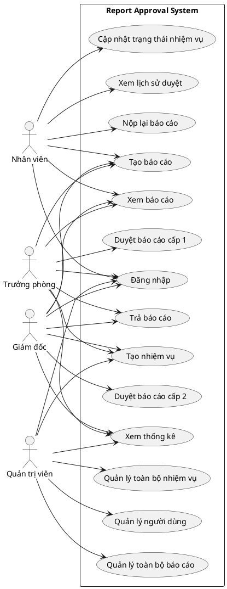

### 2.5.5. Danh sách use case chi tiết nên triển khai trong báo cáo

Nếu báo cáo của bạn không cần trình bày quá dài, nên ưu tiên làm chi tiết các use case sau:

- UC01: Đăng nhập
- UC02: Tạo báo cáo
- UC03: Duyệt báo cáo
- UC04: Trả báo cáo
- UC05: Nộp lại báo cáo
- UC06: Tạo nhiệm vụ
- UC07: Cập nhật trạng thái nhiệm vụ
- UC08: Quản lý người dùng

## 2.6. Thiết kế use case chi tiết, sơ đồ hoạt động và sơ đồ tuần tự

## UC01. Đăng nhập

- Actor: Tất cả người dùng.
- Tiền điều kiện: Tài khoản đã tồn tại trong hệ thống.
- Hậu điều kiện: Người dùng nhận JWT và vào dashboard theo vai trò.

### Luồng chính

1. Người dùng nhập `username` và `password`.
2. Frontend gửi yêu cầu `POST /api/auth/login`.
3. Backend kiểm tra tài khoản.
4. Nếu hợp lệ, hệ thống sinh JWT chứa `UserId`, `UserName`, `Role`.
5. Frontend lưu session và điều hướng đến dashboard tương ứng.

### Luồng thay thế

- Sai tài khoản hoặc mật khẩu: trả về `401 Unauthorized`.
- Thiếu dữ liệu: trả về `400 Bad Request`.

### Sơ đồ hoạt động

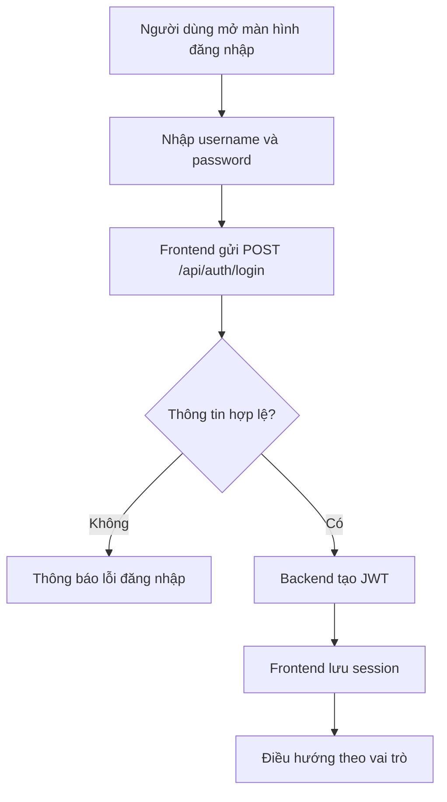

### Sơ đồ tuần tự

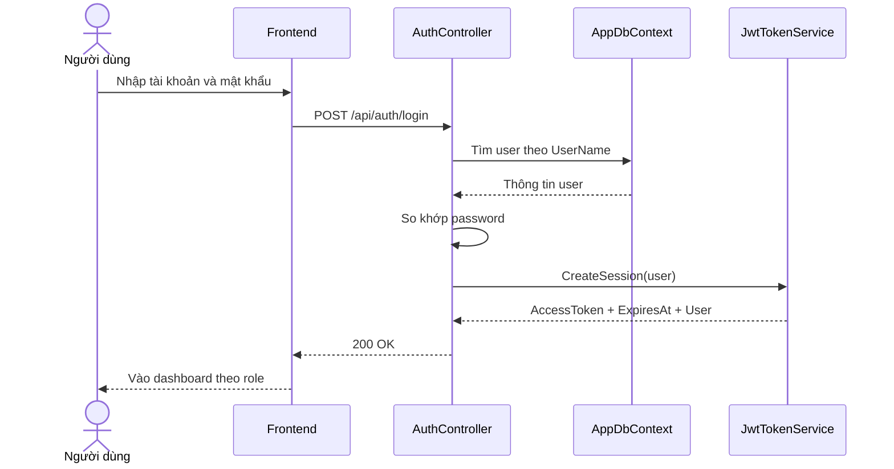

## UC02. Tạo báo cáo

- Actor: `Staff`, `Manager`, `Director`.
- Tiền điều kiện: Đã đăng nhập.
- Hậu điều kiện:
  - `Staff`: báo cáo ở `PendingManager`.
  - `Manager`: báo cáo ở `PendingDirector`.
  - `Director`: báo cáo ở `Approved`.

### Luồng chính

1. Người dùng mở form tạo báo cáo.
2. Chọn một trong hai kiểu:
   - Báo cáo thường.
   - Báo cáo theo mẫu.
3. Nhập tiêu đề và nội dung hoặc nhập dữ liệu theo mẫu.
4. Nếu dùng mẫu, frontend sinh `content` có cấu trúc và tạo file Excel đính kèm.
5. Frontend gửi `POST /api/reports`.
6. Backend kiểm tra vai trò người tạo, lưu file nếu có, xác định trạng thái khởi tạo.
7. Hệ thống thêm bản ghi vào `Reports` và thêm một dòng lịch sử `ReportApprovals` với action `Submitted`.
8. Hệ thống trả về báo cáo vừa tạo.

### Luồng thay thế

- Tiêu đề hoặc nội dung rỗng: báo lỗi.
- File đính kèm không đúng định dạng `.xls`, `.xlsx`, `.doc`, `.docx`: báo lỗi.
- `Admin` tạo báo cáo: không được phép.

### Sơ đồ hoạt động

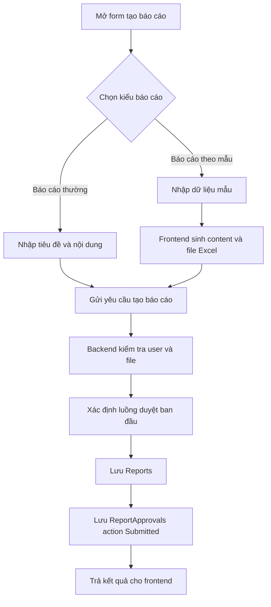

### Sơ đồ tuần tự

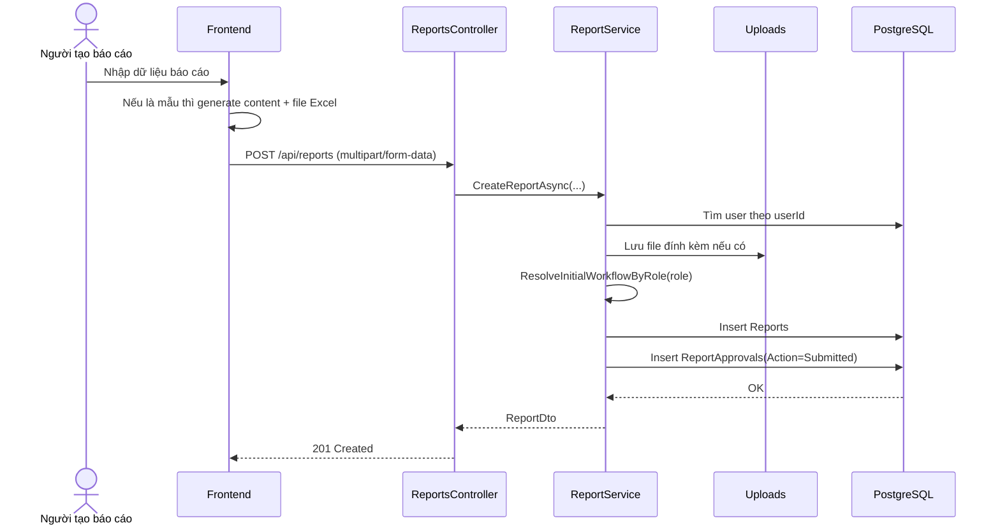

## UC03. Duyệt báo cáo

- Actor:
  - `Manager` cho cấp 1.
  - `Director` cho cấp 2.
- Tiền điều kiện: Báo cáo đang ở trạng thái chờ đúng cấp duyệt.
- Hậu điều kiện:
  - Nếu `Manager` duyệt: báo cáo chuyển sang `PendingDirector`.
  - Nếu `Director` duyệt: báo cáo chuyển sang `Approved`.

### Luồng chính

1. Người duyệt mở danh sách chờ duyệt.
2. Chọn báo cáo cần duyệt.
3. Nhập ghi chú nếu cần.
4. Gửi lệnh duyệt.
5. Backend kiểm tra vai trò có đúng cấp đang duyệt hay không.
6. Backend thêm lịch sử `Approved`.
7. Hệ thống cập nhật `CurrentLevel`, `Status`, `IsApproved`.

### Luồng thay thế

- Duyệt sai cấp: báo lỗi.
- Báo cáo đã hoàn tất: không cho duyệt tiếp.
- Báo cáo đang ở trạng thái `Returned`: không cho duyệt, phải chờ nộp lại.

### Sơ đồ hoạt động

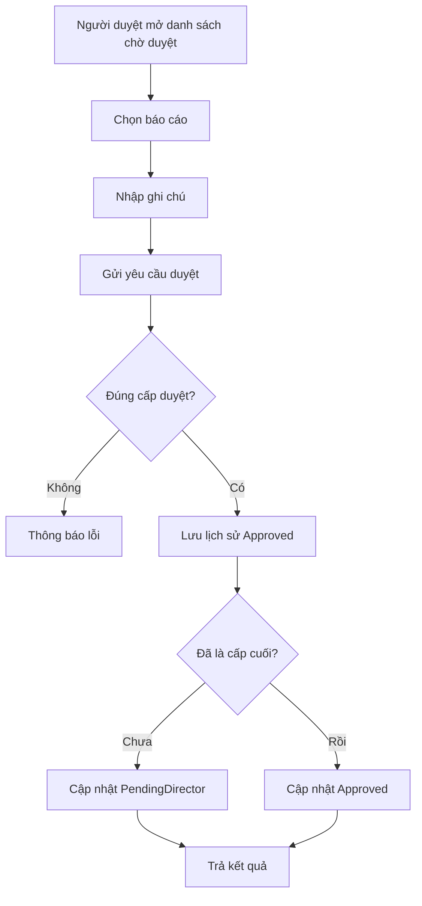

### Sơ đồ tuần tự

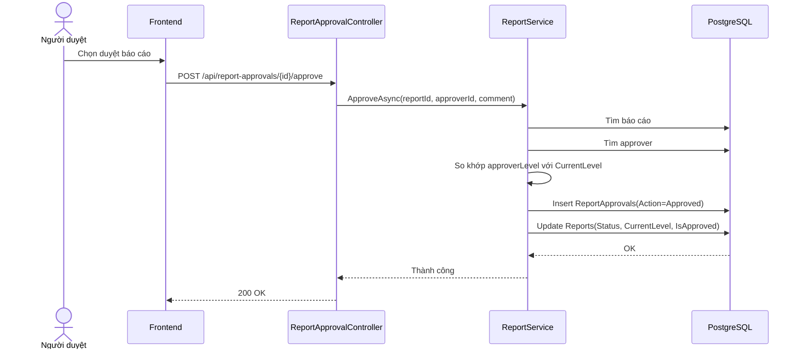

## UC04. Trả báo cáo

- Actor:
  - `Manager`: trả về `Staff`.
  - `Director`: trả về `Manager`.
- Tiền điều kiện: Báo cáo đang ở đúng cấp chờ duyệt.
- Hậu điều kiện:
  - `Manager` trả: `Status = Returned`, `CurrentLevel = 0`.
  - `Director` trả: `Status = PendingManager`, `CurrentLevel = 1`.

### Luồng chính

1. Người duyệt chọn báo cáo.
2. Nhập lý do trả về.
3. Gửi lệnh trả báo cáo.
4. Backend kiểm tra vai trò và cấp duyệt hiện tại.
5. Hệ thống lưu lịch sử trả báo cáo.
6. Hệ thống cập nhật trạng thái báo cáo theo đúng cấp trả về.

### Luồng thay thế

- Trả sai cấp: báo lỗi.
- Báo cáo đã được duyệt xong: không cho trả.

### Sơ đồ hoạt động

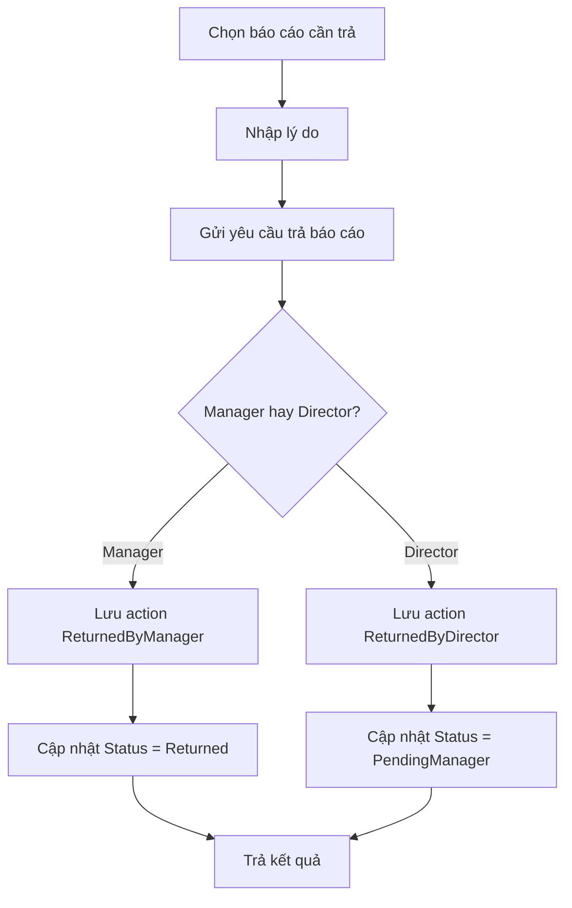

### Sơ đồ tuần tự

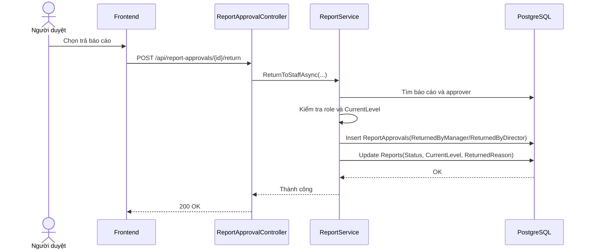

## UC05. Nộp lại báo cáo

- Actor: `Staff`.
- Tiền điều kiện: Báo cáo thuộc về nhân viên và đang ở trạng thái `Returned`.
- Hậu điều kiện: Báo cáo quay lại trạng thái `PendingManager`.

### Luồng chính

1. Nhân viên mở báo cáo bị trả về.
2. Cập nhật lại tiêu đề, nội dung hoặc dữ liệu theo mẫu.
3. Chọn lại file đính kèm nếu cần.
4. Frontend gửi `POST /api/reports/{id}/resubmit`.
5. Backend kiểm tra quyền sở hữu và trạng thái báo cáo.
6. Nếu có file mới, hệ thống xóa file cũ và lưu file mới.
7. Hệ thống cập nhật `Reports` và thêm lịch sử `Resubmitted`.

### Luồng thay thế

- Báo cáo không thuộc người dùng hiện tại: từ chối.
- Báo cáo không ở trạng thái `Returned`: từ chối.

### Sơ đồ hoạt động

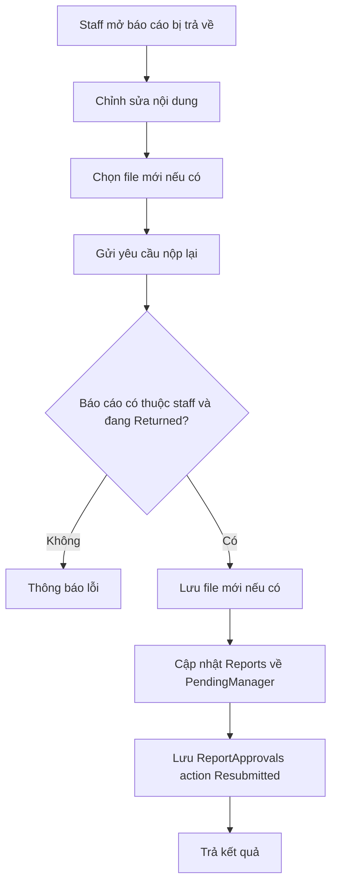

### Sơ đồ tuần tự

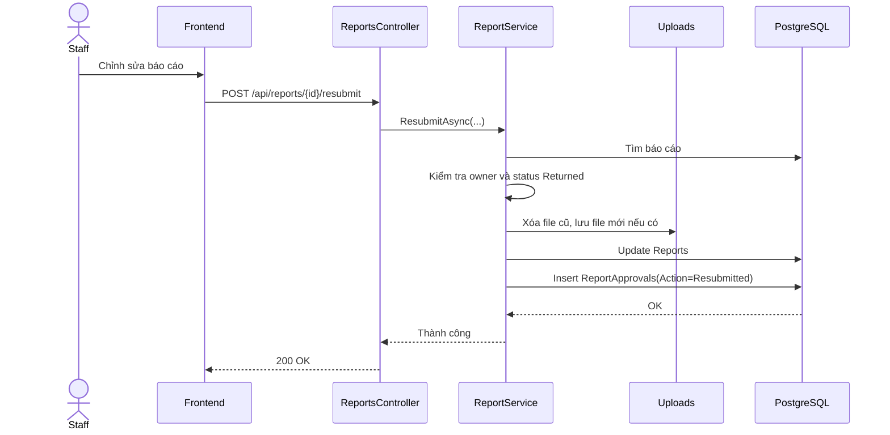

## UC06. Tạo nhiệm vụ

- Actor: `Manager`, `Director`, `Admin`.
- Tiền điều kiện: Đã đăng nhập, người nhận là `Staff`.
- Hậu điều kiện: Hệ thống tạo nhiệm vụ mới và thêm lịch sử `Assigned`.

### Luồng chính

1. Người giao nhập tiêu đề, mô tả, hạn xử lý và người nhận.
2. Frontend gửi `POST /api/tasks`.
3. Backend kiểm tra người giao không phải `Staff`.
4. Backend kiểm tra người nhận là `Staff`.
5. Hệ thống lưu `TaskItem`.
6. Hệ thống lưu `TaskHistory` với action `Assigned`.

### Luồng thay thế

- Người giao là `Staff`: từ chối.
- Người nhận không phải `Staff`: từ chối.
- Tiêu đề rỗng: từ chối.

### Sơ đồ hoạt động

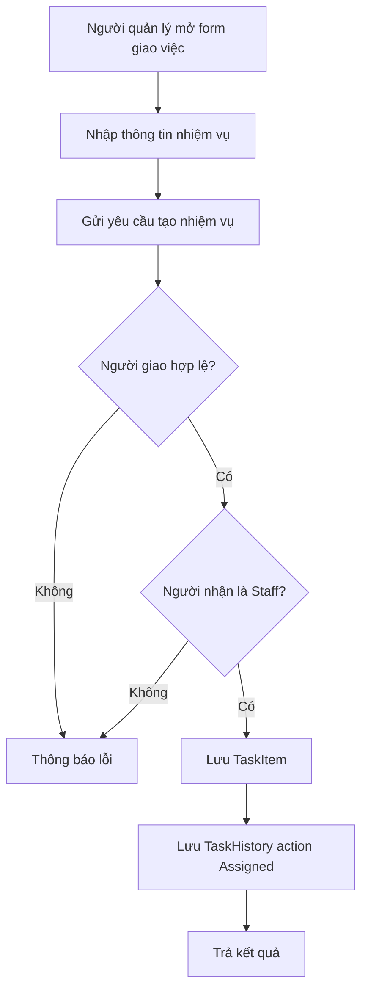

### Sơ đồ tuần tự

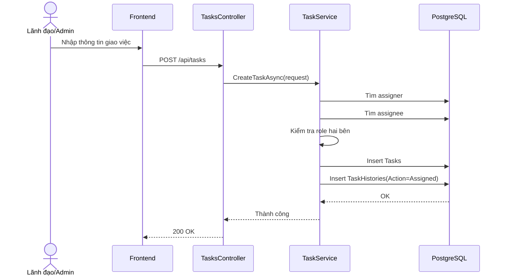

## UC07. Cập nhật trạng thái nhiệm vụ

- Actor: `Staff`.
- Tiền điều kiện: Nhiệm vụ đang được giao cho đúng nhân viên đang đăng nhập.
- Hậu điều kiện: Trạng thái nhiệm vụ được cập nhật và có thêm lịch sử xử lý.

### Luồng chính

1. Nhân viên mở danh sách nhiệm vụ của mình.
2. Chọn trạng thái mới: `Todo`, `InProgress` hoặc `Done`.
3. Frontend gửi `PATCH /api/tasks/{id}/status`.
4. Backend kiểm tra nhiệm vụ có thuộc về người dùng hiện tại không.
5. Backend cập nhật trạng thái.
6. Nếu trạng thái là `Done`, cập nhật `CompletedAt` và `CompletedByUserId`.
7. Backend thêm lịch sử vào `TaskHistories`.

### Luồng thay thế

- Người cập nhật không phải người được giao: từ chối.
- Trạng thái không thuộc tập giá trị hợp lệ: từ chối.

### Sơ đồ hoạt động

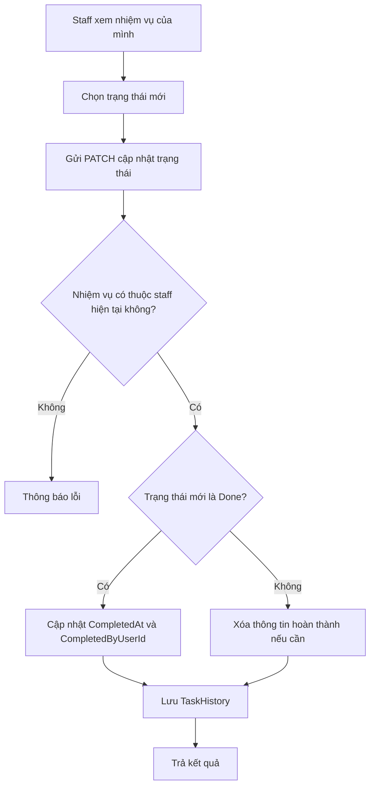

### Sơ đồ tuần tự

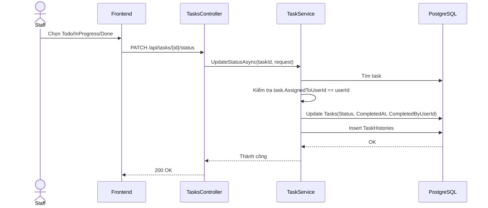

## UC08. Quản lý người dùng

- Actor: `Admin`.
- Tiền điều kiện: Đăng nhập bằng tài khoản admin.
- Hậu điều kiện: Có thể tạo user mới, đổi role, xóa user nếu không vi phạm ràng buộc.

### Luồng chính

1. Admin mở trang quản trị.
2. Chọn một thao tác:
   - Tạo tài khoản mới.
   - Cập nhật role người dùng.
   - Xóa người dùng.
3. Frontend gọi API quản trị tương ứng.
4. Backend kiểm tra quyền `Admin`.
5. Backend kiểm tra dữ liệu hợp lệ.
6. Hệ thống cập nhật dữ liệu và trả về kết quả.

### Luồng thay thế

- Tạo user trùng `UserName`: báo lỗi.
- Đổi role cho chính mình: không cho phép.
- Xóa chính mình: không cho phép.
- Xóa admin cuối cùng: không cho phép.
- Xóa user còn dữ liệu liên quan: không cho phép.

### Sơ đồ hoạt động

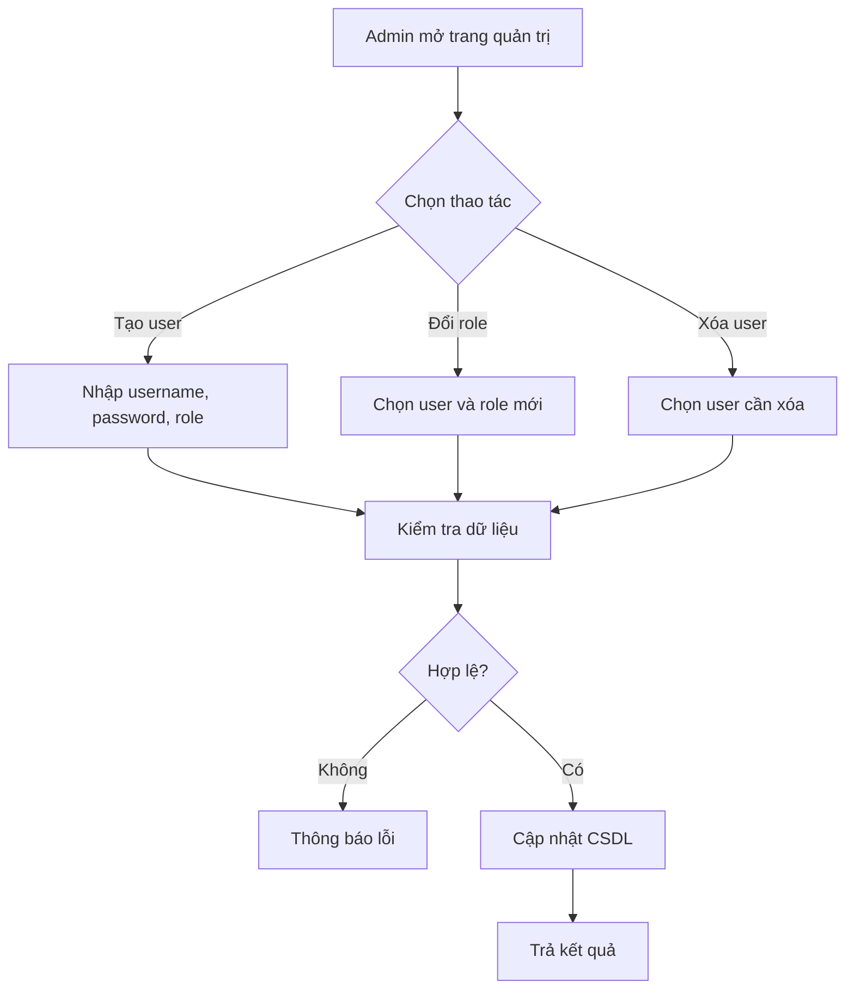

### Sơ đồ tuần tự

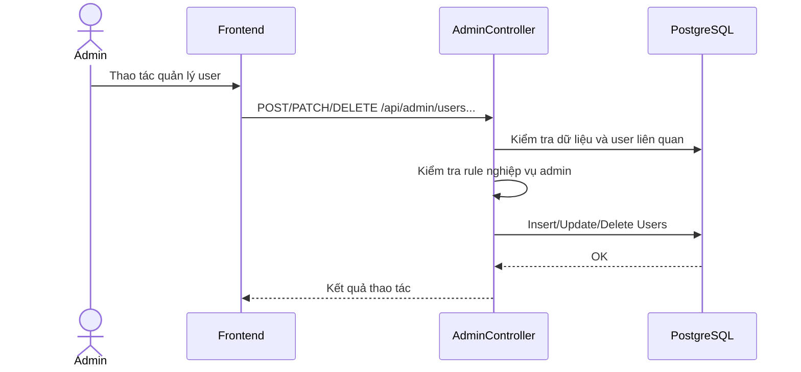

## 2.7. Thiết kế CSDL và mô hình ERD

## 2.7.1. Các bảng chính

Hệ thống hiện tại có 5 bảng chính:

- `Users`
- `Reports`
- `ReportApprovals`
- `Tasks`
- `TaskHistories`

## 2.7.2. Mô hình ER

### Thực thể và ý nghĩa

- `Users`: lưu thông tin tài khoản và vai trò.
- `Reports`: lưu báo cáo do người dùng tạo.
- `ReportApprovals`: lưu lịch sử gửi, duyệt, trả, nộp lại báo cáo.
- `Tasks`: lưu nhiệm vụ được giao cho nhân viên.
- `TaskHistories`: lưu lịch sử thay đổi trạng thái nhiệm vụ.

### Quan hệ giữa các thực thể

- Một `User` có thể tạo nhiều `Report`.
- Một `Report` có nhiều `ReportApproval`.
- Một `User` có thể xuất hiện nhiều lần trong `ReportApproval` với vai trò người thao tác.
- Một `User` có thể giao nhiều `Task`.
- Một `User` có thể được giao nhiều `Task`.
- Một `Task` có nhiều `TaskHistory`.
- Một `User` có thể tạo nhiều dòng `TaskHistory`.

## 2.7.3. Thiết kế các bảng CSDL

### Bảng `Users`

| Cột | Kiểu PostgreSQL | Ràng buộc | Ý nghĩa |
| --- | --- | --- | --- |
| `Id` | `integer` | PK | Mã người dùng |
| `UserName` | `text` | `NOT NULL`, `UNIQUE` | Tên đăng nhập |
| `Password` | `text` | `NOT NULL` | Mật khẩu |
| `Role` | `text` | `NOT NULL` | Vai trò: `Staff`, `Manager`, `Director`, `Admin` |

### Bảng `Reports`

| Cột | Kiểu PostgreSQL | Ràng buộc | Ý nghĩa |
| --- | --- | --- | --- |
| `Id` | `uuid` | PK | Mã báo cáo |
| `Title` | `text` | `NOT NULL` | Tiêu đề báo cáo |
| `Content` | `text` | `NOT NULL` | Nội dung báo cáo hoặc nội dung serialize từ mẫu |
| `Status` | `text` | `NOT NULL` | `PendingManager`, `PendingDirector`, `Returned`, `Approved` |
| `ReturnedReason` | `text` | `NULL` | Lý do trả về |
| `FileOriginalName` | `text` | `NULL` | Tên file gốc |
| `FileStoredName` | `text` | `NULL` | Tên file lưu trong hệ thống |
| `FileContentType` | `text` | `NULL` | MIME type của file |
| `CurrentLevel` | `integer` | `NOT NULL` | Cấp duyệt hiện tại |
| `IsApproved` | `boolean` | `NOT NULL` | Đã duyệt xong hay chưa |
| `CreatedAt` | `timestamp with time zone` | `NOT NULL` | Thời điểm tạo |
| `CreatedByUserId` | `integer` | FK -> `Users.Id` | Người tạo báo cáo |

### Bảng `ReportApprovals`

| Cột | Kiểu PostgreSQL | Ràng buộc | Ý nghĩa |
| --- | --- | --- | --- |
| `Id` | `uuid` | PK | Mã lịch sử duyệt |
| `ReportId` | `uuid` | FK -> `Reports.Id` | Báo cáo liên quan |
| `ApproverUserId` | `integer` | FK -> `Users.Id` | Người thao tác |
| `Level` | `integer` | `NOT NULL` | Cấp xử lý tại thời điểm thao tác |
| `Action` | `text` | `NOT NULL` | `Submitted`, `Approved`, `ReturnedByManager`, `ReturnedByDirector`, `Resubmitted` |
| `Comment` | `text` | `NOT NULL` | Ghi chú hoặc lý do |
| `ApprovedAt` | `timestamp with time zone` | `NOT NULL` | Thời gian thao tác |

### Bảng `Tasks`

| Cột | Kiểu PostgreSQL | Ràng buộc | Ý nghĩa |
| --- | --- | --- | --- |
| `Id` | `uuid` | PK | Mã nhiệm vụ |
| `Title` | `text` | `NOT NULL` | Tiêu đề nhiệm vụ |
| `Description` | `text` | `NOT NULL` | Mô tả nhiệm vụ |
| `AssignedToUserId` | `integer` | FK -> `Users.Id` | Nhân viên được giao |
| `AssignedByUserId` | `integer` | FK -> `Users.Id` | Người giao việc |
| `DueDate` | `timestamp with time zone` | `NULL` | Hạn hoàn thành |
| `Status` | `text` | `NOT NULL` | `Todo`, `InProgress`, `Done` |
| `CompletedAt` | `timestamp with time zone` | `NULL` | Thời điểm hoàn thành |
| `CompletedByUserId` | `integer` | FK -> `Users.Id`, `NULL` | Người hoàn thành |
| `CreatedAt` | `timestamp with time zone` | `NOT NULL` | Thời điểm tạo nhiệm vụ |

### Bảng `TaskHistories`

| Cột | Kiểu PostgreSQL | Ràng buộc | Ý nghĩa |
| --- | --- | --- | --- |
| `Id` | `uuid` | PK | Mã lịch sử nhiệm vụ |
| `TaskId` | `uuid` | FK -> `Tasks.Id` | Nhiệm vụ liên quan |
| `Action` | `text` | `NOT NULL` | `Assigned`, `StatusUpdated`, `Completed` |
| `Status` | `text` | `NOT NULL` | Trạng thái tại thời điểm ghi lịch sử |
| `Note` | `text` | `NOT NULL` | Ghi chú mô tả thao tác |
| `ChangedByUserId` | `integer` | FK -> `Users.Id` | Người thực hiện thay đổi |
| `ChangedAt` | `timestamp with time zone` | `NOT NULL` | Thời điểm thay đổi |

### Ràng buộc khóa ngoại và quy tắc xóa

| Quan hệ | Kiểu xóa |
| --- | --- |
| `Reports.CreatedByUserId -> Users.Id` | `RESTRICT` |
| `ReportApprovals.ReportId -> Reports.Id` | `CASCADE` |
| `ReportApprovals.ApproverUserId -> Users.Id` | `RESTRICT` |
| `Tasks.AssignedToUserId -> Users.Id` | `RESTRICT` |
| `Tasks.AssignedByUserId -> Users.Id` | `RESTRICT` |
| `Tasks.CompletedByUserId -> Users.Id` | `RESTRICT` |
| `TaskHistories.TaskId -> Tasks.Id` | `CASCADE` |
| `TaskHistories.ChangedByUserId -> Users.Id` | `RESTRICT` |

## 2.7.4. Sơ đồ ERD

### Mã Mermaid cho ERD

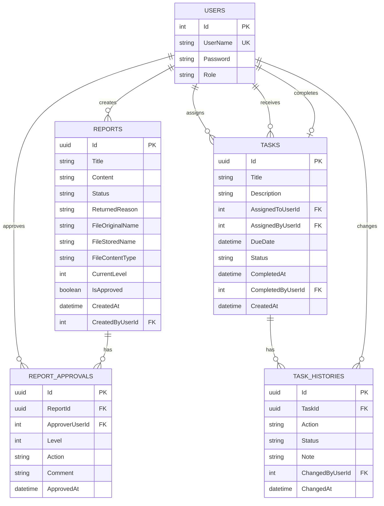

## 2.8. Khai báo sử dụng AI trong quá trình làm việc

Nếu bạn muốn bám sát mẫu, có thể thêm một đoạn ngắn như sau:

> Trong quá trình thực hiện đề tài, AI được sử dụng như một công cụ hỗ trợ tổng hợp và rà soát. Cụ thể, AI hỗ trợ hệ thống hóa yêu cầu, đối chiếu logic giữa frontend và backend, đề xuất cấu trúc tài liệu phân tích thiết kế hệ thống, gợi ý biểu diễn use case, activity diagram, sequence diagram và mô hình dữ liệu. Tuy nhiên, toàn bộ nội dung nghiệp vụ, quy trình xử lý và thiết kế cơ sở dữ liệu cuối cùng đều được kiểm tra lại dựa trên mã nguồn thực tế của hệ thống.

## Phần chốt để tránh viết sai bài

Khi làm báo cáo cho hệ thống này, bạn nên tránh các lỗi sau:

- Không được vẽ thêm bảng chi tiết riêng cho mẫu `chấm công` và `doanh thu điện` nếu đang bám đúng code hiện tại.
- Không được ghi rằng `Admin` có quyền nộp báo cáo.
- Không được ghi rằng `Director` trả báo cáo trực tiếp về `Staff`; đúng logic là trả về `Manager`.
- Không được ghi rằng `Manager` phải tự duyệt báo cáo do chính mình tạo; đúng logic là báo cáo của `Manager` đi thẳng sang `Director`.
- Không được ghi rằng mọi người đều chỉ xem báo cáo của mình; đúng logic là `Staff` chỉ xem báo cáo của mình, còn vai trò khác xem được toàn bộ.

## Nguồn logic đã đối chiếu trong code

- Backend:
  - `backend/ReportApproval.Api/Entities`
  - `backend/ReportApproval.Api/Data/AppDbContext.cs`
  - `backend/ReportApproval.Api/Data/DbSchemaUpdater.cs`
  - `backend/ReportApproval.Api/Services/ReportService*.cs`
  - `backend/ReportApproval.Api/Services/TaskService*.cs`
  - `backend/ReportApproval.Api/Controllers/*.cs`
- Frontend:
  - `frontend/src/App.tsx`
  - `frontend/src/hooks/useDashboardController.ts`
  - `frontend/src/features/reports/CreateReportForm.tsx`
  - `frontend/src/features/reports/ReportList.tsx`
  - `frontend/src/features/approval/PendingApprovalList.tsx`
  - `frontend/src/features/tasks/TaskPanel.tsx`
  - `frontend/src/features/admin/AdminPanel.tsx`
